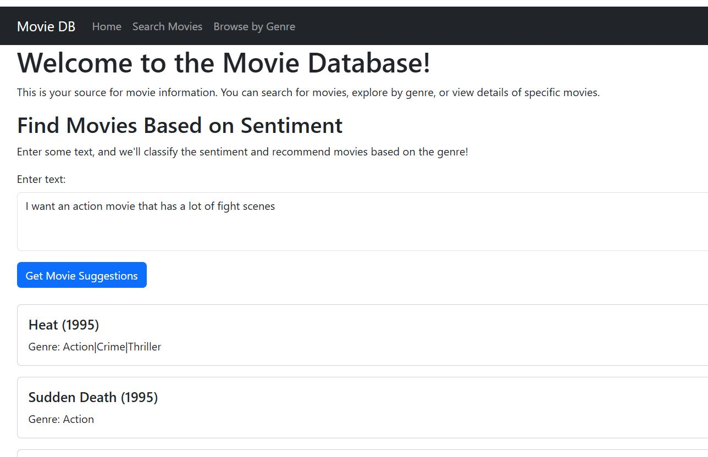
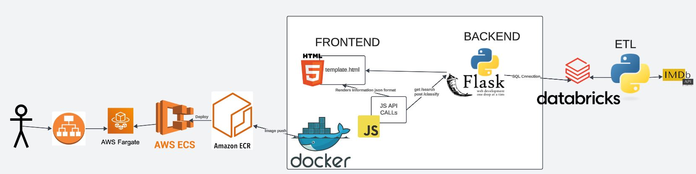
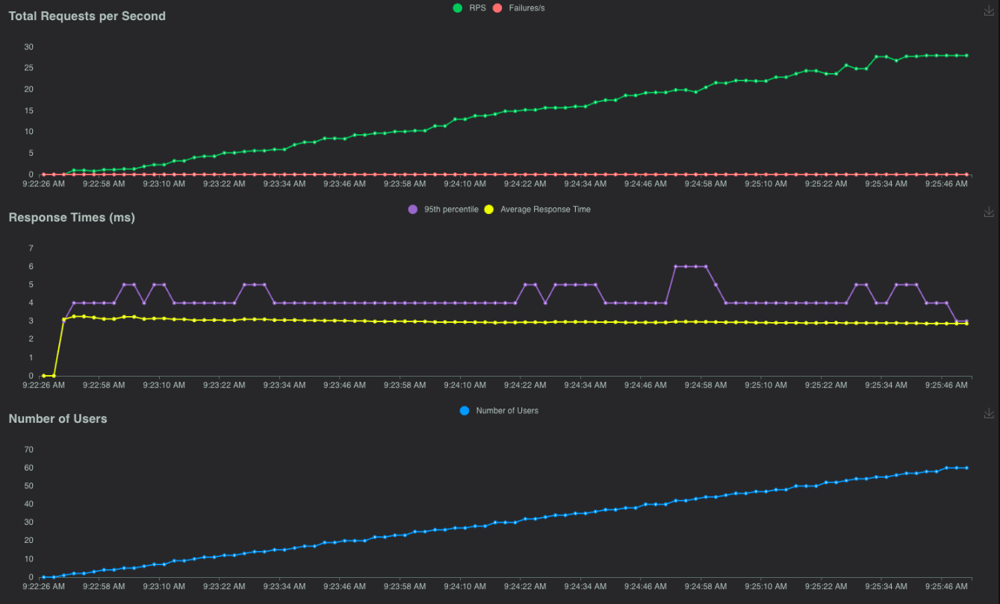

[](https://github.com/AlejandroParedesLT/IDS706_final_project_alejandro_alex_christian/actions/workflows/install.yml)

[](https://github.com/AlejandroParedesLT/IDS706_final_project_alejandro_alex_christian/actions/workflows/lint.yml)

[](https://github.com/AlejandroParedesLT/IDS706_final_project_alejandro_alex_christian/actions/workflows/test.yml)

[](https://github.com/AlejandroParedesLT/IDS706_final_project_alejandro_alex_christian/actions/workflows/format.yml)

[](https://github.com/AlejandroParedesLT/IDS706_final_project_alejandro_alex_christian/actions/workflows/IaC.yml)

# IDS706_Final Project Alejandro Paredes La Torre, Alex Ackerman, Christian Moreira

# Movie recommender
Authors: **Alejandro Paredes La Torre**, **Alex Ackerman**, **Christian Moreira**

This Flask web application is designed to interact with a movie database and provide several features related to movie discovery. The core functionality includes basic pages that allow users to explore movies and search them based on titles or genres. It features routes like the home page, a page for searching movies by title, and another page that allows users to find movies by genre..

A unique feature of the app is its integration with the Gemini API for sentiment analysis, which is used to classify input text into a movie genre. When users provide text for classification, the app sends the text to the Gemini API, which analyzes the sentiment and assigns one of several predefined genres such as Action, Comedy, or Animation. Once the genre is identified, the app queries the movie database to retrieve and display movies matching the classified genre.

In addition to these features, the app maintains robust logging for tracking various interactions such as API calls, database queries, and potential errors, making it easier to troubleshoot and monitor the app's activity. This setup provides a simple yet powerful interface for users to explore movies and leverage AI-driven sentiment analysis to recommend genres based on their input.

[](http://loadbalanc-ids706mov-1344930212.us-east-2.elb.amazonaws.com/)

[Movies App](http://loadbalanc-ids706mov-1344930212.us-east-2.elb.amazonaws.com/)

# **Demo Video (click the image or the link below)**

[Demo](https://youtu.be/qg9xXdSxwwg)

[](https://www.youtube.com/watch?v=qg9xXdSxwwg)

This application was develop with flask, using docker containers and hosted by AWS ECS Fargate.

# Project Architecture


# ETL
This project adopts an ETL process to convert csv data into a table in databricks. To do so we:
1. Extract a csv file
2. Produce a new csv where the column genre explodes into multiple rows
3. Load that new table into Databricks, which allws our subsequent app formation steps to reference this table and recommend movies off its informaation.


# ETL Illustration


# ETL Video


# **IaC**

The project uses the file awscloudformation_ecs.yml to make an automatic redeploy of the service whenever the commit takes place, the CI/CD called IaC handles this by:
- login into AWS 
- building the image
- tagging the image
- docker push to AWS registry
- updates the service so it launches again to redeploy the changes 

You can find the procedure here: [.github/workflows/IaC.yml](./.github/workflows/IaC.yml)

## Code Structure
```
.
├── backend/
│   ├── app.py               # Flask application
│   ├── templates/           # HTML templates for the web app
│   ├── static/              
│       ├──js/               # Process API calls to the backend to render the html templates
│       ├──css/              # style
│   ├── data/
│       ├── db_connection.py # Database connection module
├── docker-compose.yml       # Docker Compose configuration
├── .env                     # Environment variables for the project
```

## Flask Backend Features

- **Home Page**: Displays the main page (`/`).
- **Search Movies**: Search movies by name or genre (`/movies`, `/movies/<genre>`).
- **Individual Movie**: Fetch details for a specific movie by ID (`/movie/<id>`).

## Logs and Debugging
  
Flask application logs are essential for tracking and debugging runtime behavior. Access the logs in [backend/app.log](./backend/app.log) to monitor errors, warnings, and other runtime messages.

## Load test

Due to fianancial constraints and api limits a full load test of the deployed app was not feasible. As a substitute, load testing was performed locally using Locust which is an open source load testing tool. Calls to the local landing page of the app were made with an increasing number of users. The results of our load test can be seen below (NOTE: we were unable to conduct a load test of 10,000 user/sec due to limitations of the github/locust connection):



To alternate the load test parameters and view the results yourself. Deploy the app locally:

```bash
python backend/app.py
```

Then in a new terminal window:

```bash
# To execute the test, run Locust in the terminal with the following command:
# locust -f load_test.py --csv=../loadtest_results/loadtest --host http://127.0.0.1:8080


# Explanation of parameters:
# --csv=../loadtest_results/loadtest: Generates CSV files with the load test results in the "../loadtest_results" folder with the prefix "loadtest".
# --host http://127.0.0.1:8080: Specifies the host where your Flask app is running.
# Go to http://localhost:8089/ to see the load test in action.
```
# Use of GenAI:
Generative AI was use frequently throughout this project to enhance existing code scripts as well as provide the framework to complete tasks which we were unfamiliar with such as load testing with Locust.

# Local build:
## Prerequisites

Before running the project, ensure you have the following installed:
- [Docker](https://www.docker.com/products/docker-desktop)
- [Docker Compose](https://docs.docker.com/compose/)

## Getting Started

1. Clone the repository:
   ```bash
   git clone <repository-url>
   cd <repository-directory>
   ```

2. Create a `.env` file in the root directory with the following contents:
   ```
   FLASK_RUN_HOST=0.0.0.0
   FLASK_APP=app.py
   FLASK_ENV=development
   ACCESS_TOKEN=           #databricks access token
   SERVER_HOSTNAME=        #databricks server
   DWH_DB=                 #databricks db
   LLM_API_KEY=            #Create a user account in Gemini for their API 
   ```

3. Start the project using Docker Compose:
   ```bash
   docker-compose up --build
   ```

   This command will:
   - Build the Flask backend (`flask-app`) and Airflow components.
   - Start all services, including:
     - Flask app (accessible on [http://localhost:8080](http://localhost:5000))
     
4. Access the services:
   - Flask API: [http://localhost:8080](http://localhost:8080)
   
5. You can stop the service by:

To stop the services, run:
```bash
docker-compose down
```

To remove all containers, volumes, and networks:
```bash
docker-compose down --volumes --remove-orphans
```

---

For further questions or issues, feel free to open a discussion or raise an issue in the repository!
